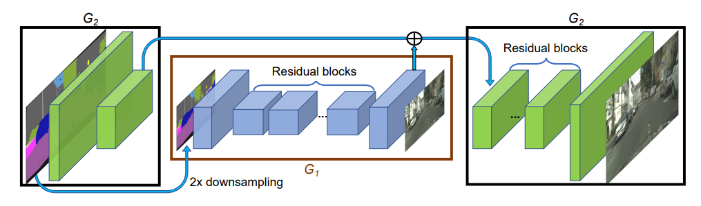
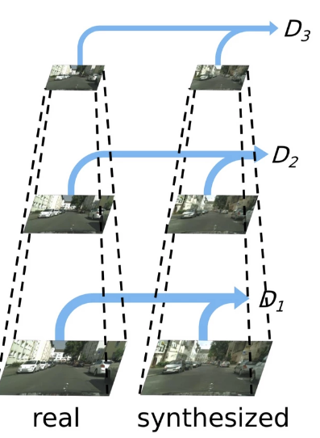

# This is a Pytoch implementation of Pix2PixHD as proposed in [High-Resolution Image Synthesis and Semantic Manipulation with Conditional GANs](https://arxiv.org/abs/1711.11585) (Wang et al. 2018)

# Architecture is as follows:
## 1. Generator
The Pix2PixHD generator is comprised of two separate subcomponent generators: $G_1$ is called the global generator and operates at low resolution (1024 x 512) to transfer styles. $G_2$ is the local enhancer and operates at high resolution (2048 x 1024) to deal with higher resolution.

The architecture for each network comprised of

<strong> G = [$G^{(F)}$, $G^{(R)}$, $G^{(B)}$], </strong>

where $G^{(F)}$ is a frontend of convolutional blocks (downsampling), $G^{(R)}$ is a set of residual blocks, and $G^{(B)}$ is a backend of transposed convolutional blocks (upsampling).

$G_1$ is trained first on low-resolution images. Then, $G_2$ is added to the pre-trained $G_1$ and both are trained jointly on high-resolution images. Specifically, $G_2^{(F)}$ encodes a high-resolution image, $G_1$ encodes a downsampled, low-resolution image, and the outputs from both are summed and passed sequentially to $G_2^{(R)}$ and $G_2^{(B)}$. This pre-training and fine-tuning scheme works well because the model is able to learn accurate coarser representations before using them to touch up its refined representations, since learning high-fidelity representations is generally a pretty hard task.

## 2. Discriminator
Pix2PixHD uses 3 separate subcomponents (subdiscriminators $D_1$, $D_2$, and $D_3$) to generate predictions.Each subdiscriminator is a PatchGAN and they all have the same architectures but $D_2$ and $D_3$ operate on inputs downsampled by 2x and 4x, respectively. The GAN objective is now modified as

$$
\begin{align*}
    \min_G \max_{D_1,D_2,D_3}\sum_{k=1,2,3}\mathcal{L}_{\text{GAN}}(G, D_k)
\end{align*}
$$

## 3. Feature Encoder
The task of generation has more than one possible realistic output. To learn this diversity, the authors introduce an encoder $E$, which takes the original image as input and outputs a feature map. They apply *instance-wise averaging*, averaging the feature vectors across all occurrences of each instance  (so that every pixel corresponding to the same instance has the same feature vector). They then concatenate this instance-level feature embedding with the semantic label and instance boundary maps as input to the generator.

The encoder $E$ is trained jointly with $G_1$. When training $G_2$, $E$ is fed a downsampled image and the corresponding output is upsampled to pass into $G_2$.

To allow for control over different features for inference, the authors first use K-means clustering to cluster all the feature vectors for each object class in the training set. Think of this as a dictionary, mapping each class label to a set of feature vectors (so $K$ centroids, each representing different clusters of features). Now during inference, one can perform a random lookup from this dictionary for each class (e.g. road) in the semantic label map to generate one type of feature (e.g. dirt). To provide greater control, one can select among different feature types for each class to generate diverse feature types and, as a result, multi-modal outputs from the same input. 

# Additional Loss Functions
In addition to the architectural and feature-map enhancements, the authors also incorporate a feature matching loss based on the discriminator.

The authors found this to stabilize training. For some semantic label map $s$ and corresponding image $x$,

$$\begin{align*}
    \mathcal{L}_{\text{FM}} = \mathbb{E}_{s,x}\left[\sum_{i=1}^T\dfrac{1}{N_i}\left|\left|D^{(i)}_k(s, x) - D^{(i)}_k(s, G(s))\right|\right|_1\right]
\end{align*}$$

where $T$ is the total number of layers, $N_i$ is the number of elements at layer $i$, and $D^{(i)}_k$ denotes the $i^{th}$ layer in discriminator $k$.

The authors also report minor improvements in performance when adding perceptual loss, formulated as

$$\begin{align*}
    \mathcal{L}_{\text{VGG}} = \mathbb{E}_{s,x}\left[\sum_{i=1}^N\dfrac{1}{M_i}\left|\left|F^i(x) - F^i(G(s))\right|\right|_1\right]
\end{align*}$$

where $F^i$ denotes the $i$th layer with $M_i$ elements of the VGG19 network.

The overall loss looks like this:

$$\begin{align*}
    \mathcal{L} = \mathcal{L}_{\text{GAN}} + \lambda_1\mathcal{L}_{\text{FM}} + \lambda_2\mathcal{L}_{\text{VGG}}
\end{align*}$$

where $\lambda_1 = \lambda_2 = 10$.